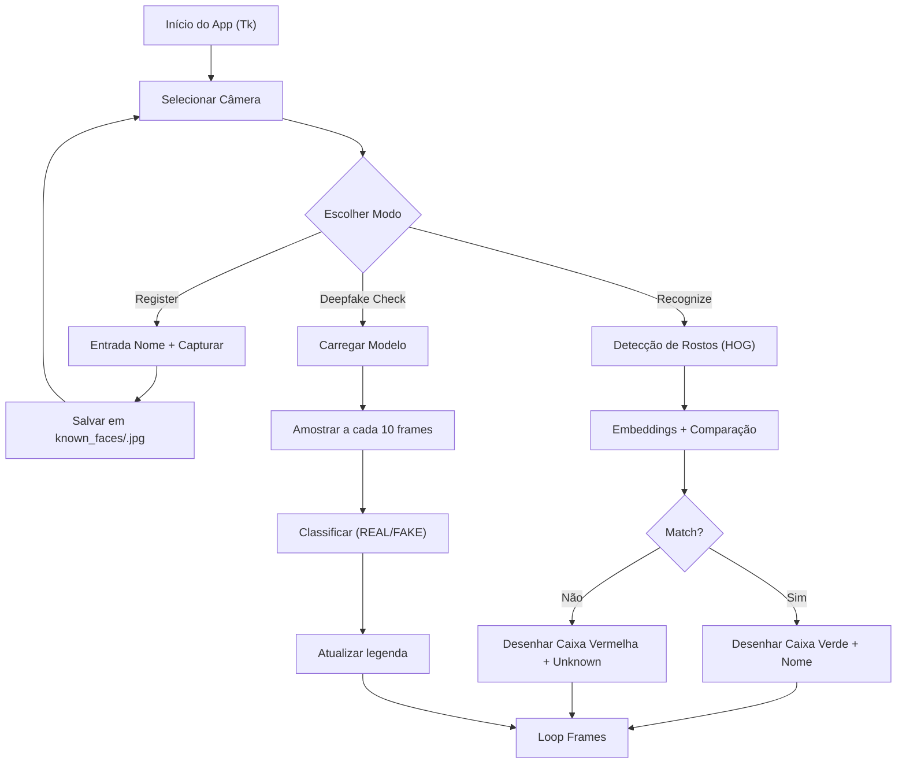

# Face Access — Reconhecimento Facial e Detecção de Deepfake

Aplicação desktop (Tkinter) em Python que:

- Faz reconhecimento facial via webcam usando `face_recognition` + `OpenCV`.
- Permite cadastrar usuários (salvando a imagem no disco) e reconhecê-los depois.
- Realiza verificação de deepfake em tempo real, usando um modelo de `PyTorch`.

Projeto da disciplina Segurança de Redes — UFABC (2025.3).

Referências:

- Dataset de vídeos deepfake: <https://www.kaggle.com/datasets/unidpro/deepfake-videos-dataset>
- Base de reconhecimento facial: <https://github.com/ageitgey/face_recognition>
- Modelo de detecção de deepfake: <https://github.com/TRahulsingh/DeepfakeDetector>
- Aplicação para geração de deepfakes: <https://github.com/hacksider/Deep-Live-Cam>

## Fluxo da Aplicação



## Visão Geral

A interface possui um painel à esquerda com seleção de câmera e botões de ação, e uma área de preview à direita com o vídeo da webcam. Existem três modos principais:

- Registro (Register): captura a imagem do usuário e salva em `known_faces/`.
- Reconhecimento (Recognize): detecta rostos no vídeo e mostra o nome se houver correspondência.
- Deepfake Check: avalia frames periodicamente e exibe a probabilidade de “REAL” ou “FAKE”.

Arquivos principais:

- `main.py`: aplicativo Tkinter, integra webcam, cadastro, reconhecimento e deepfake.
- `face_recognition_module.py`: utilitários para carregar os rostos conhecidos.
- `deepfake_detector.py`: carregamento do modelo e predição de deepfake em frames.
- `known_faces/`: imagens de usuários cadastrados (um arquivo `.jpg` por usuário).
- `data/`: pasta opcional para armazenar datasets de teste (imagem/vídeo/deepfake).

## Requisitos

Python 3.10+ recomendado (testado com 3.11). Em macOS (Apple Silicon), algumas libs podem precisar de binários específicos:

- `opencv-python`
- `face_recognition` (depende de `dlib`; no macOS pode exigir Xcode/Clang e CMake para compilar)
- `torch` e `torchvision`
- `Pillow`, `numpy`, `pytorch-lightning`, `scikit-learn`, etc.

As dependências estão em `requirements.txt`.

### Observações de Plataforma (macOS)

- Permissões de câmera: na primeira execução, o macOS pode pedir permissão. Autorize em Ajustes do Sistema > Privacidade e Segurança > Câmera.
- `dlib`: se a instalação via `pip` falhar, instale ferramentas de build (`xcode-select --install`) e `cmake` (`brew install cmake`). Alternativamente, use wheels pré-compilados se disponíveis para sua arquitetura.

## Instalação

1. Crie e ative um ambiente virtual:

```zsh
python3 -m venv .venv
source .venv/bin/activate
```

1. Atualize `pip` e instale as dependências:

```zsh
python -m pip install --upgrade pip
pip install -r requirements.txt
```

1. (Opcional) Instale CMake e ferramentas de compilação caso `dlib` precise compilar:

```zsh
xcode-select --install
brew install cmake
```

## Executando a Aplicação

1. Ative seu ambiente virtual (se ainda não estiver ativo):

```zsh
source .venv/bin/activate
```

1. Rode o app:

```zsh
python main.py
```

1. Selecione a câmera no menu à esquerda (0 geralmente é a webcam padrão). Se necessário, clique em “Open Camera”.

## Uso — Passo a Passo

### Registrar Usuário

- Clique em “Register User”.
- Digite um nome de usuário.
- Posicione-se na frente da câmera e clique em “Capture & Save”.
- O arquivo será salvo em `known_faces/<nome>.jpg` e o cache de rostos conhecidos será atualizado automaticamente.

Regras do nome:

- Apenas letras, números, `-` e `_` são mantidos. Outros caracteres são removidos.

### Reconhecer Usuário

- Clique em “Recognize User”.
- O app processa a cada outro frame para manter a fluidez.
- Se o rosto coincidir com algum cadastrado, uma caixa verde e o nome serão exibidos; caso contrário, caixa vermelha com “Unknown”.

Como funciona internamente:

- Reduz a imagem para 25% (acelera processamento).
- Detecta rostos com o modelo HOG (`face_recognition.face_locations(..., model="hog")`).
- Extrai embeddings e compara com os cadastrados (`face_distance` + `compare_faces`).

### Verificação de Deepfake

- Clique em “Deepfake Check”.
- O modelo é carregado na primeira vez (pode demorar).
- A cada 10 frames, um frame é amostrado, convertido para `PIL.Image` e classificado.
- O painel mostra “Deepfake: REAL/FAKE | R=..., F=...” e cores: verde para real, vermelho para fake.

Observações:

- O desempenho depende da GPU/CPU disponível e do modelo presente em `deepfake_detector.py` (e dos pesos em `models/`).
- Em caso de erro de predição, o app continua exibindo a câmera normalmente (falha tolerante).

## Estrutura de Pastas (resumo)

```text
known_faces/
  alice.jpg
  bob.jpg
data/
  image/
  video/
  deepfake/
models/
  best_model-v3.pt
```

## Dicas e Solução de Problemas

- Câmera não abre: altere o índice (0/1/2/3) e clique em “Open Camera”. Verifique permissões no macOS.
- Reconhecimento não funciona: garanta que `known_faces/` possui imagens nítidas, rosto centralizado e com iluminação adequada.
- `face_recognition` falhou na instalação: instale `dlib` com ferramentas de build e CMake. Consulte a documentação oficial do `dlib`.
- Deepfake modelo não carrega: confirme o caminho dos pesos em `models/` e a compatibilidade da versão de `torch/torchvision`.

## Desenvolvimento

- O loop de preview atualiza ~16 FPS (via `after(60, ...)`).
- O processamento de reconhecimento ocorre em frames alternados para reduzir latência.
- O app é tolerante a erros e não interrompe o preview em exceções não críticas.

## Licença

Uso acadêmico. Respeite as licenças das bibliotecas e dos datasets referenciados.
